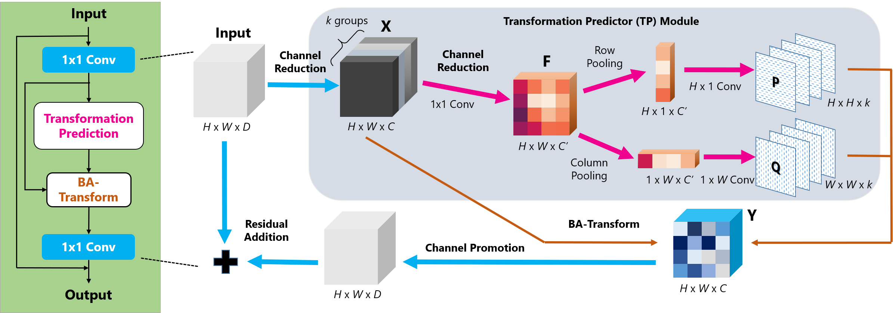

# Bilinear Attentional Transforms (BAT) for Video Classification

This is the official code of [Non-Local Neural Networks With Grouped Bilinear Attentional Transforms](http://openaccess.thecvf.com/content_CVPR_2020/html/Chi_Non-Local_Neural_Networks_With_Grouped_Bilinear_Attentional_Transforms_CVPR_2020_paper.html) for video classification on Kinetics.



## Pretrained models
Here we provide some of the pretrained models.

| Method | Backbone | Input Frames |Top-1 Acc| Link |
| :--: | :--: | :--: | :--: | :--: |
| C2D | ResNet-50 | 8 | 72.0% | [GoogleDrive](https://drive.google.com/file/d/1lH38bk2B8MVGS57uBVRJ4VP5OXMDVIvK/view?usp=sharing) / [BaiduYun](https://pan.baidu.com/s/1iqCYbl_7A659NEVpHz8cSQ)(Access Code: r0i2) |
| I3D | ResNet-50 | 8 | 72.7% | [GoogleDrive](https://drive.google.com/file/d/1LEc3X5sghJ0gDHHI30nolEFolY_C-Mzd/view?usp=sharing) / [BaiduYun](https://pan.baidu.com/s/1AJKmk9K5Jh5SzR45Y9jMfQ)(Access Code: dnwv) |
| C2D + 2D-BAT | ResNet-50 | 8 | 74.6% | [GoogleDrive](https://drive.google.com/file/d/15k2Qf2NPn9TWAH3CZwAtDMuCwgvfpw0i/view?usp=sharing) / [BaiduYun](https://pan.baidu.com/s/1u-hTUNGBg2bGs4fBhEw66w)(Access Code: inb0) |
| I3D + 2D-BAT | ResNet-50 | 8 | 75.1% | [GoogleDrive](https://drive.google.com/file/d/1RsexL9jE3-34CLo4ZK80gg2HZz1XcARo/view?usp=sharing) / [BaiduYun](https://pan.baidu.com/s/1vpkaAqphLu8cQVS1n9t7SA)(Access Code: q8d8) |
| C2D + 3D-BAT | ResNet-50 | 8 | 75.5% | [GoogleDrive](https://drive.google.com/file/d/1N1aTylbo2XkIeA7pGGo3E5FQNBAJCmy0/view?usp=sharing) / [BaiduYun](https://pan.baidu.com/s/1Kh0uhxTJiLDpe5juGtT93Q)(Access Code: rnrg) |

## Quick starts

### Requirements

- Install [Lintel](https://github.com/dukebw/lintel)
- pip install -r requirements.txt

### Data preparation
1. Download Kinetics-400 via the official [scripts](https://github.com/activitynet/ActivityNet/tree/master/Crawler/Kinetics).
2. Generate the training / validation list file. A list file looks like
```
video_path frame_num label
video_path frame_num label
...
```

### Training

To train a model, run main.py with the desired model architecture and other super-paremeters:

```bash
python main.py \
    /PATH/TO/TRAIN_LIST \
    /PATH/TO/VAL_LIST \
    --read_mode video \
    --resume /PATH/TO/IMAGENET_PRETRAINED/MODEL --soft_resume \
    --arch c2d_resnet50 --nonlocal_mod 2 --nltype bat --k 8 --tk 4 \
    --num_segments 1 --seq_length 8 --sample_rate 8 \
    --lr 0.01 --lr_steps 40 80 --epochs 100 \
    --eval-freq 5 --save-freq 5 -b 64 -j 48 --dropout 0.5
```

More training scripts can be found in [scripts](scripts). The ImageNet pretrained models can be downloaded from [GoogleDrive](https://drive.google.com/drive/folders/1KOOyftAAtP4YnCoZUdxel3LAjFdijqHv?usp=sharing) / [BaiduYun](https://pan.baidu.com/s/1Y_YtsE9DlFTq9JppKXXXPg)(Acess Code: 1r48).

### Testing

Fully-convolution inference (recommended):
```bash
python test_models.py \
    /PATH/TO/VAL_LIST \
    /PATH/TO/CHECKPOINT \
    --read_mode video \
    --arch c2d_resnet50 --nonlocal_mod 2 --nltype bat --k 8 --tk 4 \
    --test_segments 10 --test_crops 3 --seq_length 8 --sample_rate 8 \
    -j 16
```

10 crops and 25 segments:
```bash
python test_models.py \
    /PATH/TO/VAL_LIST \
    /PATH/TO/CHECKPOINT \
    --read_mode video \
    --arch c2d_resnet50 --nonlocal_mod 2 --nltype bat --k 8 --tk 4 \
    --test_segments 25 --seq_length 8 --sample_rate 8 \
    -j 16
```

## Other applications of BAT
* [Image Classification](https://github.com/BA-Transform/BAT-Image-Classification)

## Citation
If you find this work or code is helpful in your research, please cite:
````
@InProceedings{Chi_2020_CVPR,
  author = {Chi, Lu and Yuan, Zehuan and Mu, Yadong and Wang, Changhu},
  title = {Non-Local Neural Networks With Grouped Bilinear Attentional Transforms},
  booktitle = {The IEEE/CVF Conference on Computer Vision and Pattern Recognition (CVPR)},
  month = {June},
  year = {2020}
}
````
